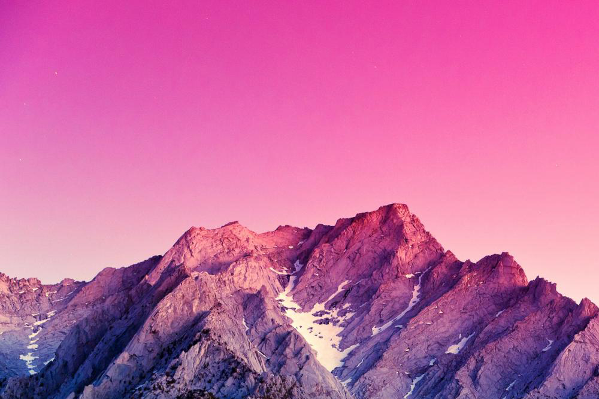

# Pure slider [wip]

Pure slider is a sCSS only slideshow. enjoy!

You can incude Pure slider scss mixin or use the appropriate
classnames directly into your Markup. Currently it's an automated
slider with a fade effect up to 4 slides.

## How to import

Pure slider can easily be imported into any project.

To import Pure slider as an external stylesheet:

````html
<link rel="stylesheet" href="stylesheets/pure-slider.css">
````

To import Pure slider into a scss file:

````scss
@import "pure-slider";
````

so far so good let see how it works.

## How it works

Pure slider contain 1 core mixin `pure-slider` with 2 arguments:

* Slides
* Time (duration of each slide)

An example:

````scss
.foo {
  @include pure-slider(3, 3s);
}
````

> Note: You must include the `s` metric or any other metric you
would like to have like 300ms or .9s.

## How to use

### HTML usage

There are some ready to use classnames:

* `.slider-2`: for a slider with 2 slides (by default time is 3s)
* `.slider-3`: for a slider with 3 slides (by default time is 3s)
* `.slider-4`: for a slider with 4 slides (by default time is 3s)

> Note: These are the current options 2,3 and 4 slides.

To create a slider with 3 slides you need to add the `.slider-3`
classname, An example:

````html
<ul class="slider-3">
  <li>
    
  </li>
  <li>
    
  </li>
  <li>
    
  </li>
</ul>
````

### Scss Usage

To create a slider via scss only you need to include the
`pure-slider` mixin. Let's consider the following markup:

````html
<ul class="foo">
  <li>
    
  </li>
  <li>
    
  </li>
  <li>
    
  </li>
</ul>
````

So the styles will be:

````scss
.foo {
  @include pure-slider(3, 2s); // 3 slides, 2s
}
````

> Note: For a markup with image tags you need to set the images
in the same dimension (ie. each image 1000px x 600px).

## slider with background images

Pure slider can also be used with background images. You don't have
to apply images at your markup since you can apply them as
background images.

An example without img tags:

````html
<ul class="foo">
  <li></li>
  <li></li>
  <li></li>
</ul>
````

Now you can add slide images as background-images directly into
your css/scss or use our automated scss mixin to do that.


`pure-slider-images` mixin takes 2 arguments:

* slides
* image name

An example:

````scss
.foo {
  @include pure-slider-images(2, demo);
}
````

The css output will be:

````css
.foo:nth-child(1) {
  background: url(../images/demo-1.jpg) no-repeat;
  background-size: cover;
}

.foo:nth-child(2) {
  background: url(../images/demo-2.jpg) no-repeat;
  background-size: cover;
}
````

> Note: You can name the images as you want as long as they share
the same prefix (ie demo-1.jpg, demo-2.jpg or foo-1.jpg, foo-2.jpg etc).
Each image shoule be in a `jpg` format but you can always modify the
images format from the `pure-slider-images` mixin.

## Future tasks

* Add a class for automatic slider
* Add arrow navigation with css only
* Add more slide effects
* Add discription at slides

## Why

### Why css only?

lightweight with simple css animations instead of javascript.

### Why Pure slider?

The concept isn't something new. Although the integration with sass mixins
gives us the flexibility to add less styles and boost our development process.

### Why to bother?

You don't have to, it's a fun project that I highly use when there is a
need for a simple as that slideshow.

Cheers :)
